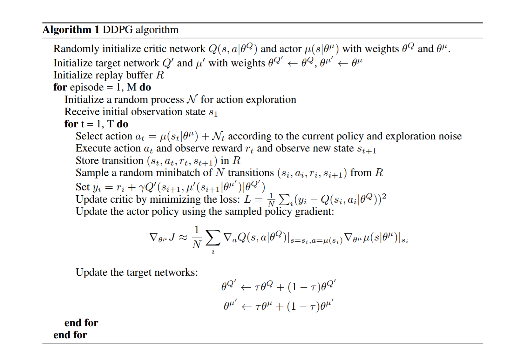

# DRL-ContinousControl

[//]: # (Image References)


# Project 2: Continuous Control

### Algorithm

For this project I implemented the Deep Deterministic Policy Gradient algorithm as described in the paper: [Continuous Control With Deep Reinforcement Learning](https://arxiv.org/abs/1509.02971)

This approach moves beyond standard online Q-Learning in several respects:
* It uses an off-policy actor-critic algorithm that can learn policies in high-dimensional, continuous action spaces
* It leverages experience replay by training off-policy with samples from a buffer to minimize correlation issues
* Use separate target networks (actor and critic) for generating the targets in the learning update

These improvements help to address instabilities associated with Q-Learning.  The paper's abstract describes it as follows:

> We adapt the ideas underlying the success of Deep Q-Learning to the continuous
> action domain. We present an actor-critic, model-free algorithm based on the deterministic 
> policy gradient that can operate over continuous action spaces. Using
> the same learning algorithm, network architecture and hyper-parameters, our algorithm robustly 
> solves more than 20 simulated physics tasks, including classic problems such as 
> cartpole swing-up, dexterous manipulation, legged locomotion and car driving.

The pseudo-code from the paper is as follows:



#### Modifications

Initial experiments with the algorithm described in the paper did not yield the desired results.  Although the algorithm was able to learn, it was extremely slow (many hundreds of episodes) and the mean reward plateaued at a score of 10-15.  

After some additional investigation, I came upon a modification to the original DDPG at [OpenAI Spinning Up](https://spinningup.openai.com/en/latest/algorithms/ddpg.html)

This implementation incorporated the following key features that yielded immediate improvements:
* A learning step to better control the update of the networks relative to the amount of experiences collected
* Gradient clipping in the critic network
* A decay term to gradually reduce the introduction of noise as training progresses

The pseudo-code from Spinning Up is as follows:


### Implementation

The code used for this project is heavily based on the solution in the Udacity Deep Reinforcement Learning github repo, specifically the [ddpg-pedal solution](https://github.com/udacity/deep-reinforcement-learning/tree/master/ddpg-bipedal).

The key components are as follows:

#### model.py:  
This file contains the network classes for the Actor and the Critic.  The networks use rectified non-linearity (ReLU activation) for all the hidden layers.  The final output layre of the actor used tanh activation to keep the actions bounded.  Both networks had hidden layers of 400 and 300.  Both networks apply Batch Normalization after the first hidden layer.  For the Critic, the actions aren't input to the network until the second hidden layer.  The implemenation is nearly an exact match of the description found in Section 7 (Experiment Details) of the Continuous Control paper.

#### dqn_agent.py:
This file contains two classes.  The Agent class is the main interface for interacting with and learning from the enviroment.  The Agent delegates to the ReplayBuffer class to store the experience tuples needed for experience replay.  The key methods are described below.
##### Agent.__init__
A key feature of this constructor is that it instantiates two QNetworks, qnetwork_local and qnetwork_target.  While qnetwork_local is being trained, qnetwork_target is used to generate stable targets for computing the loss.
##### Agent.act
This method returns an action based on the input state.  It makes an epsilon greedy selection based on the prediction from qnetwork_local.  Since epsilon is an input parameter, the training loop can gradually move from exploration to exploitation.
##### Agent.step
The training loop will choose an action and provide it to the enviroment.  With the environment's response, we have a full experience (state, action, reward, next_state, done) that can be stored in the ReplayBuffer.  For every UPDATE_EVERY calls to Agent.step, the method will sample BATCH_SIZE samples from the ReplayBuffer and update both QNetworks by calling Agent.learn
##### Agent.learn
This method implements the target computation and gradient descent step from the algorithm pseudo-code, with the modification of using an Adam optimizer.  The updated qnetwork_local is then used to gradually update (based on interpolation parameter TAU) the qnetwork_target.
#### Network.ipynb
The dqn() method in the notebook is the main training loop.  It uses Agent.act to choose actions, uses the actions to generate experiences from the enviroment, and feeds the experiences to Agent.step, where the learning is triggered after UPDATE_EVERY steps.
### Hyperparameters
The following hyperparameter settings were used:
```
BUFFER_SIZE = int(1e5)  # replay buffer size
BATCH_SIZE = 64         # minibatch size
GAMMA = 0.99            # discount factor
TAU = 1e-3              # for soft update of target parameters
LR = 5e-4               # learning rate 
UPDATE_EVERY = 4        # how often to update the network
```
The model architecture for the neural network is described above in the model.py section.

### Plot of Rewards
[Navigation.ipynb](https://github.com/stevenapsel/DRL-Navigation/blob/main/Navigation.ipynb) shows the plot of rewards and the number of episodes required.  As shown below, it took 707 episodes to achieve an average score of 13.
```
Episode 100	Average Score: 1.12
Episode 200	Average Score: 4.19
Episode 300	Average Score: 6.30
Episode 400	Average Score: 8.56
Episode 500	Average Score: 10.32
Episode 600	Average Score: 11.99
Episode 700	Average Score: 12.51
Episode 800	Average Score: 12.63
Episode 807	Average Score: 13.00
Environment solved in 707 episodes!	Average Score: 13.00
```

### Ideas for Future Work
Here are a few ideas that could improve the training speed and/or performance of the agent.
#### Hyperparameter Tuning
The hyperparameters we've used here were fine for completing the project.  Are they optimal?  Probably not.  Some additional exploration could yield better results.
#### Network Architecture
We used a fairly simple network in QNetwork.  Further exploration could look at varying the size (or number) of the hidden layers.
#### Prioritized Experience Replay
For this project, our replays were uniformly sampled.  What if we could choose sampled from a weighted distribution that gave preference to experiences that are more likely to have an larger impact on learning?  That is the idea behind [prioritized experience replay](https://arxiv.org/abs/1511.05952).
